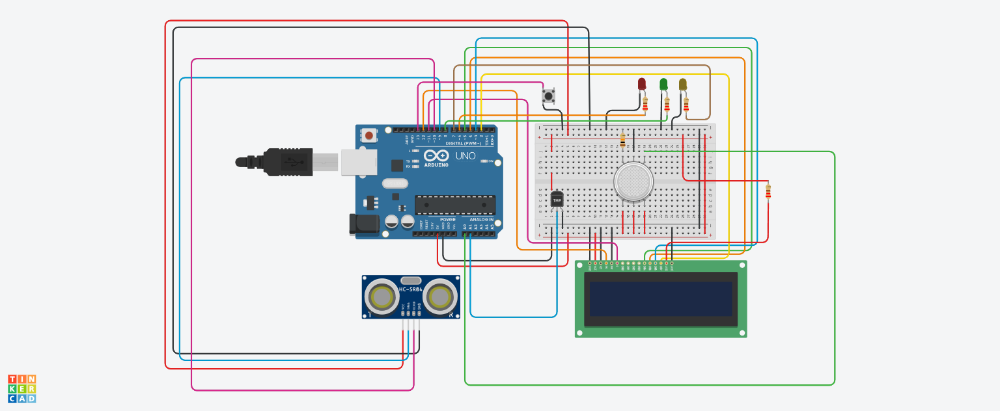

# 🍳 Smart Kitchen Safety & Environment Monitoring System 🛡️

An intelligent, low-cost safety solution built with **Arduino** to prevent kitchen accidents. This system monitors gas leaks, high temperatures, and human presence simultaneously, providing real-time alerts through an LCD and color-coded LEDs.

---
🔍 Overview
Kitchen accidents caused by gas leaks and unattended high temperatures are a leading cause of household fires. This project addresses that problem by combining three sensors into a unified safety monitor that alerts users instantly through visual indicators and a live LCD readout.

---
## 🌟 Key Features

- **🔴 Gas Leak Alert:** Instantly detects smoke or LPG leaks using an MQ sensor and triggers a **Red LED**.
- **🟡 Fire/Heat Monitor:** Constant temperature tracking with a TMP36 sensor. Triggers a **Yellow LED** if heat exceeds safe limits (50°C).
- **🟢 Safe Presence Tracking:** Uses an Ultrasonic sensor to detect people. The **Green LED** glows only when someone is present and the environment is **SAFE**.
- **📟 Real-time LCD Dashboard:** Displays live temperature readings and safety status (e.g., "SAFE", "GAS LEAK", "HIGH TEMP").
- **🔘 Manual System Reset:** Includes a physical push-button to reset alarms once the hazard is cleared.

---

## 🛠️ Hardware Components

| Component | Function |
| :--- | :--- |
| **Arduino Uno** | The Brain of the System |
| **16x2 LCD Display** | Real-time Data Visualizer |
| **MQ Gas Sensor** | Smoke/Gas Leak Detection |
| **TMP36 Sensor** | Ambient Temperature Monitoring |
| **HC-SR04 Sensor** | Proximity/Human Presence Detection |
| **LEDs (R, Y, G)** | Visual Status Indicators |
| **Push Button** | Manual Alarm Reset |
| **Resistors** | Circuit Protection (220Ω & 10kΩ) |

---

## 🧠 System Logic (How it works)

The system continuously loops through three main safety checks:

1.  **Safety Condition:** If `Gas < Threshold` AND `Temp < 50°C`, the system is in **SAFE** mode.
2.  **Danger Mode:** 
    - If gas is detected → **RED LED ON** + LCD shows `"!! GAS LEAK !!"`.
    - If high heat is detected → **YELLOW LED ON** + LCD shows `"!! HIGH TEMP !!"`.
3.  **Human Interaction:** If a person is within 50cm AND the environment is safe, the **GREEN LED** turns on as a "Safe Interaction" indicator.

---

## 📸 Circuit Diagram

Below is the circuit design simulated in **Tinkercad**:

 

---

## 💻 Simulation & Installation

### How to use:
1.  **Clone the Repo:** `git clone https://github.com/Masum8823/Smart-Kitchen-Safety-System.git`
2.  **Arduino IDE:** Open the `.ino` file in your Arduino IDE.
3.  **Connect Hardware:** Follow the circuit diagram to connect your sensors to the Arduino Uno.
4.  **Upload:** Select your COM port and hit **Upload**.

---

## 🚀 Future Improvements
- [ ] Add a **Piezo Buzzer** for audible alarms.
- [ ] Integration with **Blynk/ESP8266** for mobile notifications (IoT).
- [ ] Automatic **Exhaust Fan** activation during gas leaks.

---

### 👨‍💻 Developed by
**[MD. Abdulla Al Masum]**  
*Computer Science & Engineering Student*  
*Interest in Embedded Systems*

---
